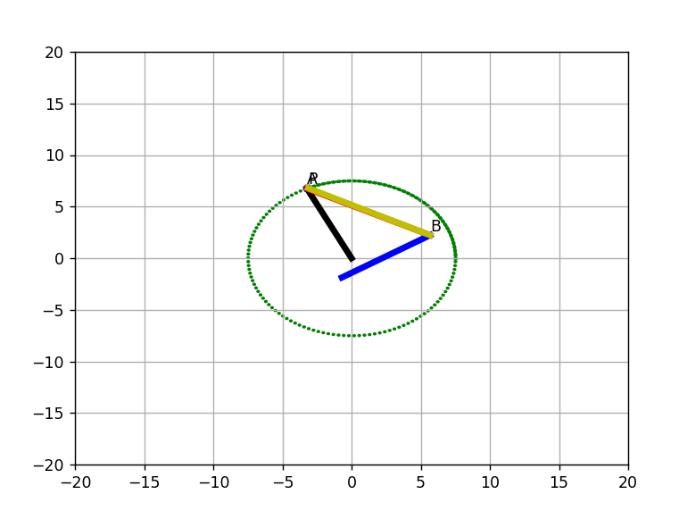
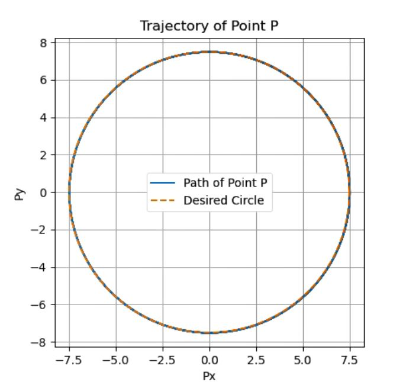

## Code Overview

This project contains a Python script that optimizes the parameters of a four-bar mechanism using Particle Swarm Optimization (PSO). The goal of the optimization is to make point `P` follow a 15 cm trajectory while respecting constraints on the link lengths.

### Script Details

- **Mechanism Simulation**: The script simulates a four-bar mechanism where each link's length is represented by parameters `r1`, `r2`, `r3`, `r4`, and `r5`.
- **Objective Function**: The objective function minimizes the error between the actual path of point `P` and the desired circular trajectory of 15 cm.
- **PSO Optimization**: The PSO algorithm from the `pyswarm` library is used to search for optimal parameters (link lengths and input angle) that minimize the deviation from the desired trajectory.

The optimized parameters will be printed, and a plot of the path followed by point `P` will be generated, along with the desired trajectory for comparison.

The full details of the implementation can be found in the script `fourbar_pso_based.py`.

## Example Output
After running the script, the following optimized parameters will be shown:
```bash
Best parameters:  
r1=7.300 cm, r2=5.200 cm, r3=5.600 cm, r4=7.800 cm, r5=3.100 cm
theta1=1.570 rad

## Example of Optimized Mechanism

Here are two images showing the trajectory before and after the optimization process for the four-bar mechanism:

<p align="center">
  
  
</p>

In the left image, you can see the mechanism's initial state. The right image shows the optimized trajectory of point `P`, ensuring it traces the desired 15 cm trajectory.
